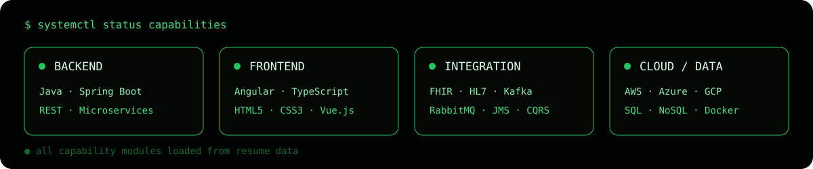

<div align="center">
  <a href="https://rodrigonoroes.github.io/">
    
  </a>

  <a href="https://rodrigonoroes.github.io/">
    
  </a>
</div>

## `$ whoami`

Experienced software developer with a **20+ year track record** of software development for
telecommunications, banking, insurance, healthcare, government, education and retail companies.

Passionate about tackling complex technical challenges, collaborating with multidisciplinary
teams and continuously exchanging knowledge to build high-performance, secure applications.

<div align="center">
  <a href="https://rodrigonoroes.github.io/">
    
  </a>
</div>

## `$ skills --grouped`

| Module | Technologies |
| --- | --- |
| `languages` | Java · JavaScript · TypeScript · Kotlin · J2EE · JavaFX · JSP · Servlets · ILE RPG IV · GeneXus |
| `backend` | Spring Boot · Spring Integration · Spring AI · Spring Security · Spring Batch · REST · SOAP · OpenAPI · Swagger · Microservices · Camunda · BPMN · CQRS |
| `frontend` | Angular · AngularJS · Vue.js · HTML5 · CSS3 |
| `integration` | FHIR · HL7 · Kafka · RabbitMQ · JMS · Messaging · Apache ActiveMQ Artemis |
| `data` | Oracle · PL/SQL · DB2 · MySQL · Microsoft SQL Server · PostgreSQL · MongoDB · DynamoDB · Salesforce · IBM AS400 |
| `cloud` | AWS · Azure · Google Cloud Platform · Heroku · S3 · CloudFront · Elastic Beanstalk · EC2 · ECS · Docker · Kubernetes |
| `security_testing` | OAuth2 · JWT · OWASP · JUnit · Mockito · Automated Testing · API Testing · Integration Testing · TDD · Selenium |
| `ai_observability` | Codex · OpenCode · Amazon Bedrock · Splunk · Dynatrace · Observability · Monitoring |
| `practices` | Git · Documentation · Enterprise Architecture · Agile · Scrum · Kanban · High Availability · Disaster Recovery · Business Continuity |

## `$ history --professional`

### T6 Health Systems — Senior Java Developer

`05/2025 — CURRENT`

- Architect and implement robust, scalable and secure Java applications and services using
  Java 17, Spring Boot and Spring Security.
- Design RESTful APIs, microservices and backend logic for enterprise healthcare platforms.
- Integrate healthcare data standards including FHIR and HL7.
- Troubleshoot technical issues, perform root-cause analysis and implement resilient production
  solutions.

### Scotiabank — Programmer Analyst

`10/2023 — 05/2025`

- Worked with Java 8/17, Spring Boot, OpenAPI, SOAP, DB2 and IBM AS400.
- Contributed to the Credit Card Service Layer integration team.
- Integrated TSYS payment solutions through SOAP and REST services.
- Used Google Cloud Platform, Splunk and Dynatrace.

### T6 Health Systems — Senior Java Developer

`10/2022 — 08/2023`

- Developed backend services for a healthcare iPad application.
- Used Java 17, Spring Boot 3, Apache ActiveMQ Artemis, AWS, Azure and Microsoft SQL Server.
- Built healthcare integrations using FHIR and HL7.

### OPAH — Senior Java Developer

`07/2021 — 09/2022`

- Worked on the CVC travel e-commerce price and markup squad.
- Used Java 11, SQL, J2EE, REST APIs, Spring Boot, microservices, Kubernetes and AWS.

### Certsys — Senior Java Developer

`02/2021 — 07/2021`

- Designed and implemented Spring Batch applications for financial data processing.
- Improved performance in legacy banking processes for Votorantim.

### OSF Digital — Senior Java Developer

`02/2015 — 02/2021`

- Integrated Salesforce with e-commerce inventory processing using Spring Batch, RabbitMQ and
  Heroku.
- Developed an online assessment and academic management system using CQRS, Spring and Java with
  an international team.
- Built Java Spring Boot and Vue.js APIs for telecom billing and payment services.
- Developed financial portals using Java and OpenText.

### Instituto Atlântico — Systems Analyst II

`09/2014 — 01/2015`

- Designed and implemented a public-school management system using JavaFX, Spring,
  Microsoft SQL Server and J2EE.

### iFactory Solutions — Software Developer

`01/2007 — 09/2014`

- Developed Java and Portlet solutions for international enterprise portals.
- Worked with teams in Brazil and the United States.
- Built hospitality intranet features using Java and AngularJS.
- Developed banking and telecom portals using Java, J2EE and OpenText.

### DETRAN-CE — Software Developer

`09/2005 — 01/2007`

- Developed Java applications using JSP, Servlets, JasperReports, JavaScript, XML, Oracle and
  PL/SQL.

### Bermas — Systems Analyst

`02/2002 — 08/2005`

- Worked on ERP systems using ILE RPG IV, IBM AS400, Oracle Forms and Reports, Java and GeneXus.

## `$ education && certification`

```text
EDUCATION
Bachelor of Science in Computer Science
University of Fortaleza · 2001—2006

CERTIFICATION
Sun Certified Programmer for Java · SCJP
```

## `$ contact --public`

```text
email: rodrigo.noroes@gmail.com
```

[Send an e-mail](mailto:rodrigo.noroes@gmail.com)

<div align="center">
  <a href="https://rodrigonoroes.github.io/">
    
  </a>
</div>
