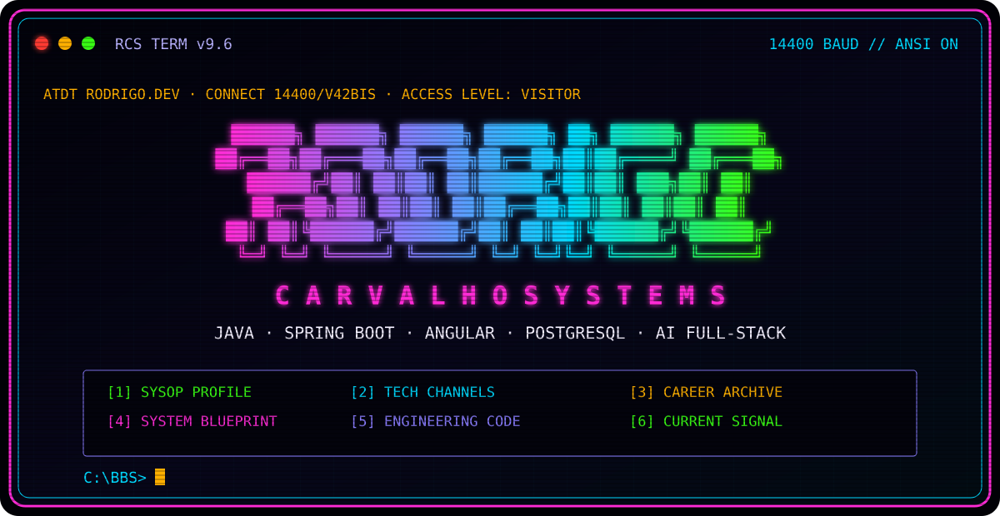
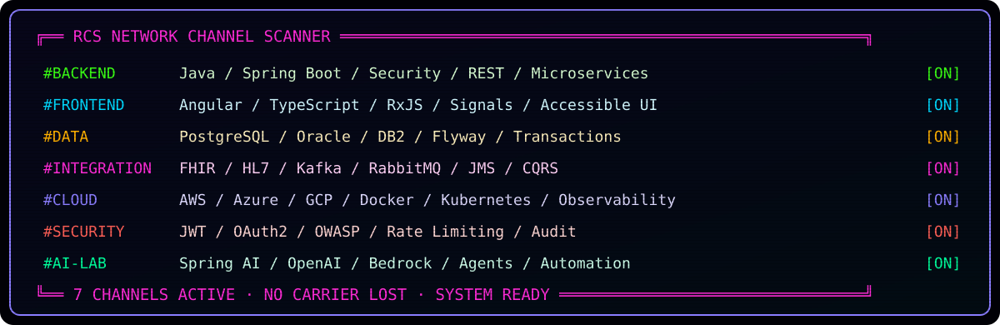

<div align="center">
  
</div>

```text
ATDT RODRIGO.DEV
CONNECT 14400/V42BIS

Synchronizing terminal ............. OK
Loading ANSI color driver .......... OK
Negotiating secure connection ...... OK
Entering RODRIGO CARVALHO SYSTEMS ... GRANTED
```

<div align="center">


</div>

```text
╔══════════════════════════[ MAIN MENU ]══════════════════════════════╗
║                                                                    ║
║   [1] SYSOP PROFILE       Who is behind the keyboard?              ║
║   [2] TECH CHANNELS       Backend, frontend, data, cloud and AI     ║
║   [3] CAREER ARCHIVE      20+ years of production experience       ║
║   [4] SYSTEM BLUEPRINT    Full-stack architecture patterns          ║
║   [5] ENGINEERING CODE    Principles used to ship software         ║
║   [6] CURRENT SIGNAL      What is being built now                   ║
║                                                                    ║
║   Command: READ ALL                                  [ENTER]        ║
╚════════════════════════════════════════════════════════════════════╝
```

## `[1] SYSOP PROFILE // WHOAMI.SYS`

<table>
<tr>
<td width="38%">

```text
        ___________________
       /                  /|
      /  RODRIGO.DEV     / |
     /__________________/  |
     |  ______________  |  |
     | |              | |  |
     | | C:\> whoami_ | |  |
     | |              | |  |
     | |______________| |  /
     |__________________| /
        _[__]___[__]_
       /_____________\
      /_______________\
```

</td>
<td width="62%">

```text
USER ............ Rodrigo Carvalho
ROLE ............ Senior Java / Full-Stack Developer
LOCATION ........ Toronto, Canada
UPTIME .......... 20+ years building software
PRIMARY MODE .... Java + Spring Boot + Angular
SECONDARY MODE .. Cloud + Integration + AI
STATUS .......... ONLINE / BUILDING
```

I build secure, maintainable products from database to user interface. My experience spans
healthcare, banking, payments, telecommunications, insurance, education, government, retail and
travel platforms.

</td>
</tr>
</table>

<div align="center">
  
</div>

## `[2] TECH CHANNELS // STACK.CFG`

| BBS channel | Active modules |
| :--- | :--- |
| `#BACKEND` | Java, Spring Boot, Spring Security, REST, SOAP, OpenAPI, microservices, Spring Batch |
| `#FRONTEND` | Angular, TypeScript, RxJS, Signals, Reactive Forms, HTML, CSS, accessible UI |
| `#DATA` | PostgreSQL, Oracle, DB2, SQL Server, MongoDB, DynamoDB, Flyway, transactions |
| `#INTEGRATION` | FHIR, HL7, Kafka, RabbitMQ, JMS, ActiveMQ Artemis, CQRS, BPMN |
| `#SECURITY` | JWT, refresh sessions, OAuth2, BCrypt, OWASP, CORS, rate limiting, validation |
| `#CLOUD` | AWS, Azure, GCP, Docker, Kubernetes, S3, CloudFront, Elastic Beanstalk |
| `#AI-LAB` | Spring AI, OpenAI APIs, Amazon Bedrock, agents, automation, AI-assisted delivery |
| `#QUALITY` | SOLID, clean architecture, JUnit, Mockito, integration tests, TDD, observability |

```ansi
┌─[ SYSTEM CAPABILITIES ]─────────────────────────────────────────────┐
│ JAVA ████████████████████  SPRING ████████████████████             │
│ WEB  ██████████████████░░  DATA   ██████████████████░░             │
│ AI   ███████████████░░░░░  CLOUD  █████████████████░░░             │
└────────────────────────────────────────────────────────────────────┘
```

## `[3] CAREER ARCHIVE // HISTORY.LOG`

```text
2002                                                                  2026+
  │                                                                      │
  ├── Enterprise systems, government services and Java web apps          │
  ├── Banking, payments, telecom and high-traffic digital portals        │
  ├── E-commerce, batch processing, messaging and microservices          │
  └── Healthcare interoperability with Java, FHIR and HL7 ───────────────┘
```

- **T6 Health Systems — Senior Java Developer:** healthcare services, Spring Boot, Spring
  Security, REST APIs, FHIR/HL7 interoperability and production reliability.
- **Scotiabank — Programmer Analyst:** credit-card and payment integrations using Java, Spring
  Boot, OpenAPI, SOAP/REST, DB2, IBM AS400, GCP, Splunk and Dynatrace.
- **OPAH, Certsys and OSF Digital — Senior Java Developer:** travel e-commerce, financial batch
  workloads, Salesforce integrations, messaging, CQRS, microservices and cloud platforms.
- **Earlier enterprise systems:** government, education, telecom, hospitality and banking
  solutions using Java/J2EE, Oracle, SQL Server, JavaFX, AngularJS and enterprise CMS platforms.

```text
┌─ EDUCATION.DAT ─────────────────────────────────────────────────────┐
│ B.Sc. in Computer Science — University of Fortaleza                │
│ Sun Certified Programmer for Java — SCJP                           │
│ Professional collaboration in English and Portuguese               │
└─────────────────────────────────────────────────────────────────────┘
```

## `[4] SYSTEM BLUEPRINT // ARCHITECTURE.ANS`

### `SECURE FULL-STACK APPLICATION NODE`

A reference architecture for maintainable enterprise applications built with Java, Spring Boot,
Angular and PostgreSQL.

```text
          ┌─────────────────────── BROWSER CLIENTS ───────────────────────┐
          │  ANGULAR UI  │  ADMIN CONSOLE  │  OPERATIONS TOOLING        │
          └────────────┴───────────┬─────────┴────────────────────────────┘
                                   │ HTTPS / JSON
          ┌────────────────────────▼──────────────────────────────────────┐
          │  SPRING BOOT API                                             │
          │  Authentication · Business APIs · Sessions · Integrations    │
          ├───────────────────────────────────────────────────────────────┤
          │  Domain Services · Security · Audit · Validation · SMTP      │
          ├────────────────────────┬──────────────────────────────────────┤
          │  JPA / HIBERNATE       │  FLYWAY MIGRATIONS                  │
          └────────────────────────┴──────────────────┬───────────────────┘
                                                     │
                                           ┌─────────▼─────────┐
                                           │    POSTGRESQL     │
                                           └───────────────────┘
```

## `[5] ENGINEERING CODE // PRINCIPLES.TXT`

```text
01: Keep controllers thin and business rules explicit.
02: Prefer cohesive designs over premature abstractions.
03: Treat authentication, authorization and privacy as product features.
04: Automate repeatable work and validate every meaningful change.
05: Build accessible interfaces with clear loading, success and error states.
06: Use AI to amplify engineering judgment — never to replace it.
```

## `[6] CURRENT SIGNAL // NOW.BBS`

```diff
+ Designing secure Java and Spring Boot APIs backed by PostgreSQL and Flyway
+ Building modern Angular experiences with typed contracts and accessible interfaces
+ Improving session security, recovery flows, data isolation and auditability
+ Exploring AI-powered workflows for product development and software delivery
```

```text
╔══════════════════════════[ CONTACT NODE ]════════════════════════════╗
║                                                                    ║
║  GitHub ....... github.com/rodrigonoroes                            ║
║  Protocol ..... Pull requests, issues and technical conversations   ║
║                                                                    ║
║  [Q] Log off     [M] Send message     [R] Read repositories         ║
╚════════════════════════════════════════════════════════════════════╝
```

<div align="center">
  
</div>
